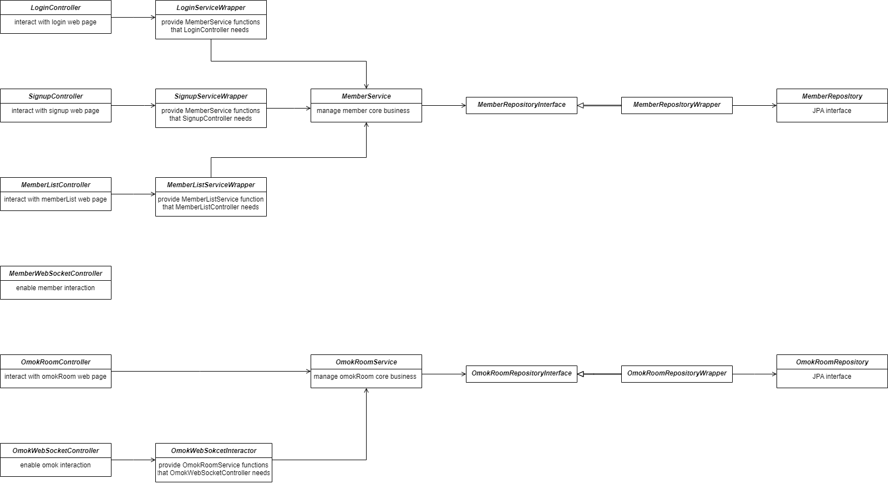

<div id="top"></div>
<!--
*** Thanks for checking out the Best-README-Template. If you have a suggestion
*** that would make this better, please fork the repo and create a pull request
*** or simply open an issue with the tag "enhancement".
*** Don't forget to give the project a star!
*** Thanks again! Now go create something AMAZING! :D
-->


<!-- PROJECT SHIELDS -->
<!--
*** I'm using markdown "reference style" links for readability.
*** Reference links are enclosed in brackets [ ] instead of parentheses ( ).
*** See the bottom of this document for the declaration of the reference variables
*** for contributors-url, forks-url, etc. This is an optional, concise syntax you may use.
*** https://www.markdownguide.org/basic-syntax/#reference-style-links
-->


<!-- PROJECT LOGO -->
<br />
<div align="center">
  

<h3 align="center">MultiOnlineOmok</h3>

  <p align="center">
    you can signup, login, multi-omok
    <br />
    <a href="https://github.com/ji-seung-ryu/multiOnlineOmok"><strong>Explore the docs »</strong></a>
    <br />
    <br />
    <a href="https://github.com/ji-seung-ryu/multiOnlineOmok">View Demo</a>
    ·
    <a href="https://github.com/ji-seung-ryu/multiOnlineOmok/issues">Report Bug</a>
    ·
    <a href="https://github.com/ji-seung-ryu/multiOnlineOmok/issues">Request Feature</a>
  </p>
</div>


<!-- TABLE OF CONTENTS -->
<details>
  <summary>Table of Contents</summary>
  <ol>
    <li>
      <a href="#about-the-project">About The Project</a>
      <ul>
          <li><a href="#architecture">Architecture</a></li>
          <li><a href="#built-with">Built With</a></li>
      </ul>
    </li>
    <li>
      <a href="#getting-started">Getting Started</a>
      <ul>
        <li><a href="#prerequisites">Prerequisites</a></li>
        <li><a href="#installation">Installation</a></li>
      </ul>
    </li>
    <li><a href="#usage">Usage</a></li>
    <li><a href="#license">License</a></li>
    <li><a href="#contact">Contact</a></li>
  </ol>
</details>


<!-- ABOUT THE PROJECT -->
## About The Project

you can register
<br>

<br>
you can login
<br>

<br>
you can see active members
<br>

<br>
you can play omok with others 
<br>


 


<p align="right">(<a href="#top">back to top</a>)</p>

### Architecture

<br>


<br>


<p align="right">(<a href="#top">back to top</a>)</p>

### Built With

* [SPRING BOOT](https://spring.io/projects/spring-boot/)

<p align="right">(<a href="#top">back to top</a>)</p>


<!-- GETTING STARTED -->
## Getting Started


### Prerequisites

* git
  ```sh
  sudo yum install -y git
  ```

* java
  ```sh
  sudo amazon-linux-extras install java-openjdk11
  ```

  
### Installation

1. Clone the repo
   ```sh
   git clone https://github.com/ji-seung-ryu/multiOnlineOmok.git
   ```
2. move to multiOnlineOmok
   ```sh
   cd multiOnlineOmok
   ```
3. modify authority
   ```sh
   sudo chmod 777 ./gradlew
   ```
4. build 
   ```sh
   ./gradlew build
   ```

<p align="right">(<a href="#top">back to top</a>)</p>


<!-- USAGE EXAMPLES -->
## Usage

signup, login, multi-omok-play

<p align="right">(<a href="#top">back to top</a>)</p>


<!-- LICENSE -->
## License

Distributed under the MIT License. See `LICENSE.txt` for more information.

<p align="right">(<a href="#top">back to top</a>)</p>


<!-- CONTACT -->
## Contact

8514199@gmail.com

[https://www.instagram.com/ji_seungg/?hl=ko](https://www.instagram.com/ji_seungg/?hl=ko)

[https://github.com/ji-seung-ryu/multiOnlineOmok](https://github.com/ji-seung-ryu/multiOnlineOmok)

<p align="right">(<a href="#top">back to top</a>)</p>


